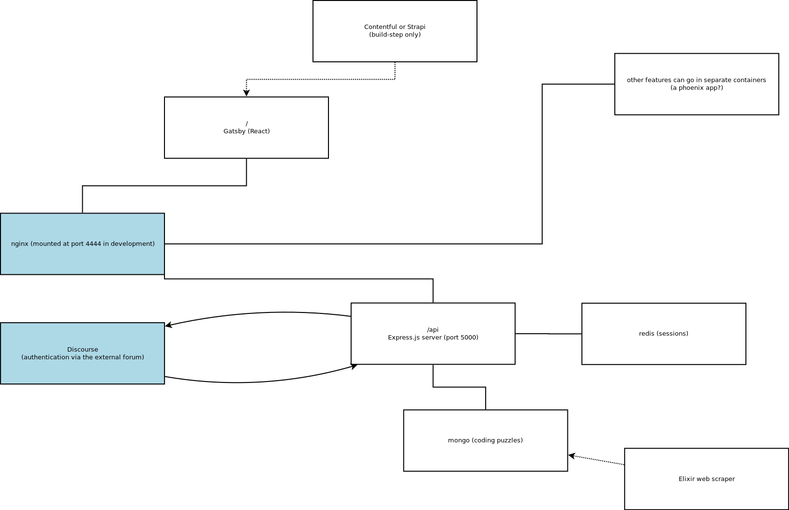

# Code Self Study Website

This is the new [Code Self Study](https://codeselfstudy.com/) website.

This is an unfinished work in progress. :construction: Attend a meetup to find out how to contribute.

## Goals:

- help people in the group find something in common to work on
- meetup activity
- learn Docker better

### Ideas so far:

- authenticate with the forum
- send a coding puzzle of the day into the forum, slack, and/or the browser extension so that interested people have a common task to discuss
- add new puzzles (links to other sites or original puzzles)
- mark puzzles that you've completed
- saving puzzles to do later
- use the browser extension to add new puzzles to the database?
- fetch puzzle by difficulty and type of problem
- commenting? (forum integration or separate)
- voting

## Technologies

See the `docker-compose.yml` file for an overview of the services that are running.

- Gatsby + (contentful or strapi)
- Express.js for the API ("MERN Stack")
- Redis for session storage in Express.js
- MongoDB for persistent storage
- React for an SPA (with Bootstrap)
- Docker for easy development and deployment
- Python 3 scraping tools (possibly to be replaced with puppeteer scrapers)

### How It Works

- Nginx serves the app in development and production, proxying to the other servers behind it. It serves on port 80, but in development, you can visit it at port 4444.
- Gatsby serves the main pages (backed by a headless CMS)
- There is a React SPA being served in another container with another instance of nginx. It serves the puzzles at `/puzzles`.
- Express.js is running on port 5000, mounted at `/api`. (`/api` is not visible in the Express code, so that might be confusing if you don't know to expect it. See the nginx configuration files.)
- A Redis container will handle Express sessions (after users authenticate with the forum).
- A MongoDB container will store the coding puzzle and user data. (This is an experiment with "MERN stack".)



## Development

To run the application:

- Be sure that you have Docker installed.
- Turn off your local MongoDB server, because this will run it's own Mongo in Docker on the default port (27017).
- Start the application with Docker Compose:

```text
$ docker-compose up --build
```

Then visit [localhost:4444](http://localhost:4444/).

See the routes files for the available routes.

To shutdown the containers:

```text
$ docker-compose down
```

(If you stop the containers by hitting `ctrl-c`, it won't remove the containers.)

To enter a running database container, find its ID:

```text
$ docker container ps
```

Then, these commands:

```text
$ docker container exec -it <container_id> sh
```

You get information about the volumes like this:

```text
$ docker volume ls
$ docker volume inspect <volume_name>
```
